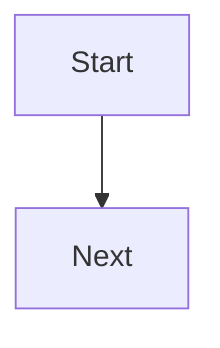

# analyze-codebase

当用户要求你分析、阅读源码、反向工程、理解架构、梳理运行时行为、提取设计、记录内部机制，或为某个仓库构建 wiki 时，使用此 skill。

## 调用入口逻辑

每次调用此 skill 时，先根据用户参数决定执行分支：

1. 如果用户传入了下面列出的某个显式命令参数，就遵循对应分支。
2. 如果没有提供参数，执行默认行为：扫描 inbox → 如果 Phase 0 注释未完成则运行 Phase 0 → 执行五阶段分析方法论 → 写入 wiki。
3. 无论走哪个分支，都先按需确保 wiki 目录骨架存在，然后从被分析仓库运行 `ls codebase-wiki/questions/open/ codebase-wiki/questions/solving/ codebase-wiki/inbox/ codebase-wiki/items/`，检查存在时的 `codebase-wiki/.annotation-progress.json`，检查 items 各状态下数量，让 agent 看到当前未解决问题、待处理笔记、注释进度和当前 items 队列。
4. 在面向用户的回复开头，用完全一致的紧凑格式报告当前队列状态：`📋 5 open questions | 2 inbox notes | annotated: 47/87 | items: 1draft 3next-actions 2in-progress 0review 5done`。如果 items 目录下没有文件，使用 `items: none`。如果注释范围还未计算，使用 `annotated: unknown`。

这个队列检查不能替代 inbox 处理。对于默认、指定 phase、指定 target、inbox-only 和 resume 运行，在仓库分析前继续按下文描述处理 inbox。对于 learning-loop 命令，使用队列检查为命令建立上下文，然后执行请求的问题/计划/items/博客操作；除非用户明确要求，否则不要运行无关的 phase。

## 行动前必须内化的核心原则

- 不要从“文件/函数”出发。要从“系统行为”出发。
- 始终提取三层信息：runtime + abstraction + tradeoff。
- 这是一个从代码到系统设计的反向抽象过程：
  code structure → runtime mechanism → core abstractions → architecture boundaries → design tradeoffs → system cognition output.
- 把源码当作证据。分析中的每个结论都必须基于文件路径、符号、调用路径、配置、测试或运行时入口点。
- 不要把实现细节倾倒进 analysis view。把可复用的概念、对象、算法、不变量和 tradeoff 放进 atom，再从 analysis view 链接过去。
- 让 wiki 对未来 agent 保持有用：稳定的 slug、明确的 backlink、相对 Markdown 链接，以及清晰的 stale/update 说明。

## 命令语义

用户可以用以下形式调用此 skill：

- `/analyze-codebase` — 默认行为：扫描 inbox → 如果 Phase 0 注释未完成则运行 Phase 0 → 在当前目录运行全部五个分析 phase → 写入 `./codebase-wiki/`。
- `/analyze-codebase --annotate` — 只运行 Phase 0 注释，然后停止。
- `/analyze-codebase --annotate-scope "src/**/*.ts"` — 将 Phase 0 注释限制在给定 glob。
- `/analyze-codebase --reannotate <path>` — 强制重新注释指定文件或目录，忽略已有中文 docstring。
- `/analyze-codebase --phase 3` — 扫描 inbox → 只运行指定 phase。
- `/analyze-codebase --target ../some-other-repo` — 分析另一个仓库路径，而不是当前目录。
- `/analyze-codebase --inbox-only` — 只处理 inbox，不运行新的代码分析。
- `/analyze-codebase --resume` — 增量更新：读取现有 wiki，识别过期/缺失部分，只更新发生变化的内容。
- `/analyze-codebase --question "问题原文"` — 将可证伪问题写入 `questions/open/<slug>.md`，然后立即生成 `plans/<slug>.md`。
- `/analyze-codebase --plan <question-slug>` — 为已有问题生成或重新生成学习计划。
- `/analyze-codebase --next` — 根据最近对话上下文以及当前 questions、plans 和 atoms，重写 `items/next-actions/<当前日期>.md`（生成一个新的 next-action item）。
- `/analyze-codebase --items` — 根据最近对话上下文以及当前 questions、plans 和 atoms，在 `items/` 下创建新 item 文件（默认放到 `next-actions/`）。
- `/analyze-codebase --resolve <question-slug>` — 追加 `## Resolution` 摘要并链接到相关 atoms，然后把问题从 `questions/open/` 或 `questions/solving/` 移到 `questions/answered/`。
- `/analyze-codebase --propose-blog` — 根据当前 wiki 状态和最近对话提出 1-3 个候选博客主题；只在聊天里描述论点和大纲，等待用户 yes/no，不写文件。
- `/analyze-codebase --draft <topic-slug>` — 用户确认主题后，将博客初稿写入 `blog/drafts/<topic-slug>.md`。
- `/analyze-codebase --publish <topic-slug>` — 将草稿从 `blog/drafts/` 移到 `blog/published/`，并把状态更新为 `published`。
- `/analyze-codebase --daily` — 在 `logs/reports/daily/<YYYY-MM-DD>.md` 生成今天的日报。
- `/analyze-codebase --daily 2026-06-14` — 为指定日期生成日报。
- `/analyze-codebase --weekly` — 在 `logs/reports/weekly/<YYYY-Www>.md` 生成本 ISO 周的周报。
- `/analyze-codebase --weekly 2026-W24` — 为指定 ISO 周生成周报。
- `/analyze-codebase --retro` — 在 `logs/reports/retro/<YYYY-MM-DD>.md` 生成复盘记录；需要时询问用户范围，默认使用本周。

当参数不是字面可用时，根据用户请求推断 target。相对 target 要按当前工作目录解析。始终把 wiki 写入被分析仓库的 `./codebase-wiki/` 目录，而不是 skill 目录。

## 分析分支的强制 inbox 扫描

在调用入口队列检查之后，面向分析的调用要先处理 inbox，再进行仓库分析；这包括默认、指定 phase、指定 target、inbox-only 和 resume 运行。唯一例外是 `./codebase-wiki/` 还不存在；此时先创建目录骨架，再扫描空 inbox。Learning-loop 命令仍然先执行队列检查，并可在相关时参考 inbox 笔记，但除非用户明确要求，否则不应运行无关的仓库分析。

### Inbox 处理工作流

1. 扫描 `codebase-wiki/inbox/*.md`，排除 `codebase-wiki/inbox/processed/`。
2. 对每条未处理笔记：
   - 读取原始内容。
   - 识别笔记中提到的概念、对象、算法、不变量、tradeoff、决策、runtime facts 和架构线索。
   - 对每个能映射到现有 atom 的条目，把相关笔记内容合并或追加到该 atom。保留已有的有用内容。
   - 对每个新概念，在 `codebase-wiki/atoms/` 中创建新 atom。
   - 在每个被触及 atom 的末尾，添加或更新 `## Sources` 章节，链接回原始 inbox 笔记路径。如果笔记会被移动到 processed，则链接到 processed 位置。
3. 抽取完成后，将原始笔记从 `inbox/<file>.md` 移到 `inbox/processed/<file>.md`。
4. 保留原始内容。不要删除或重写用户笔记，除了添加 frontmatter 字段：
   - `processed: <date>`
   - `extracted_to: [list of atom links]`
5. inbox 处理完成后，除非指定了 `--inbox-only`，否则继续执行请求的分析模式。

`processed` 使用今天的实际日期。如果笔记已有 frontmatter，就更新它；如果没有，就在原始正文上方添加 frontmatter。

## Wiki 落地结构

此 skill 必须在被分析仓库下生成并维护完全如下结构：

```text
codebase-wiki/
  README.md                ← wiki 入口，列出所有分析视图和原子笔记索引
  .annotation-progress.json ← Phase 0 中文注释断点续跑进度
  atoms/                   ← 原子笔记：每个概念/对象/算法/不变量一篇，可按主题嵌套子文件夹（≤7 文件时抽取）
    <concept-slug>.md      ← 单一概念，frontmatter 含 type/tags/refs
    <topic>/               ← 当根目录 atom 数 >7 时，按主题抽取的子文件夹（如 raft/、storage/）
      <concept-slug>.md
  analysis/                ← 分析视图：从不同主体复用底层原子笔记
    01-repo-map.md         ← 阶段1产出
    02-runtime.md          ← 阶段2产出
    03-core-design.md      ← 阶段3产出
    04-architecture.md     ← 阶段4产出
    05-tradeoffs.md        ← 阶段5产出
    architecture-diagram.md
    startup-flow.md
    request-flow.md
    lessons-learned.md
  inbox/                   ← 用户随手丢笔记的地方
    <user-notes>.md        ← 用户原始输入
    processed/             ← 抽取过的笔记移动到这里
      <user-notes>.md
  questions/               ← 学习闭环中的可回答问题
    open/                  ← 未解决的问题
      <slug>.md
    solving/               ← 正在解决中的问题（有 active item/task 在推进）
      <slug>.md
    answered/              ← 已解决的问题；从 open/ 或 solving/ 移入
      <slug>.md
    abandoned/             ← 主动放弃的问题归档
      <slug>.md
  plans/                   ← 每个问题一份学习计划；文件名和 question slug 对齐
    <question-slug>.md
  items/                    ← Items 工作流：每个 item 是一个可追踪状态的行动项
    draft/                   ← 还没想清楚的 item
    next-actions/                 ← 已明确、准备开始的 item
    in-progress/                 ← 正在做的 item
    review/               ← 做完、等待回顾的 item
    done/                 ← 已经复盘过的 item
  tasks/                    ← 具体任务：items 可以关联到具体的 tasks
    <task-slug>.md          ← 每个 task 描述一个具体的可执行任务
  reference/                ← 补充参考资料：为 atoms 提供原始素材和上下文，atoms 只保留最有价值的精华
    <topic-slug>.md         ← 原始代码片段、设计文档摘录、外部链接摘要等
  blog/
    drafts/                ← 用户确认博客选题后才写初稿
      <topic-slug>.md
    published/             ← 发表后归档
      <topic-slug>.md
  logs/                    ← 操作日志层：记录所有提问和 skill 事件
    2026-06-15.md          ← 每天一个文件，当天所有事件追加
    2026-06-16.md
    reports/
      daily/
        2026-06-15.md      ← 日报
      weekly/
        2026-W24.md        ← 周报，ISO 周编号
      retro/
        2026-06-15.md      ← 用户主动叫“复盘”时生成
```

不要创建其他顶层 wiki 文件夹。只有当额外文件位于 `atoms/`、`analysis/`、`inbox/processed/`、`questions/`、`plans/`、`items/`、`tasks/`、`reference/` 或 `blog/` 内，并且在需要被发现时从 `README.md` 链接过去，才允许创建。

## 链接与 atom 规则

- 所有 wiki 链接都必须是相对 Markdown 链接。
- 不要使用 `[[atoms/event-loop]]` 这类 wiki-link 语法。
- 在 analysis 文件中，把 `[[atoms/event-loop]]` 写成 `[event loop](../atoms/event-loop.md)`；在 `README.md` 中写成 `[event loop](atoms/event-loop.md)`。
- `analysis/` 中的文件不得重复概念定义。它们应该总结证据，并链接到 atoms 获取定义。
- 每个 atom 必须只描述一个概念、对象、算法、不变量或 tradeoff。
- 每个 atom 必须包含 frontmatter，至少包含：

```yaml
---
type: concept | object | algorithm | invariant | tradeoff
tags: []
backlinks: []
refs: []
---
```

其中：

- `type` 是 `concept`、`object`、`algorithm`、`invariant`、`tradeoff` 之一。
- `tags` 是可搜索关键词，例如 `runtime`、`startup`、`state-machine`、`api`、`storage`、`ownership`。
- `backlinks` 指向引用此 atom 的 analysis 文件，路径使用从 atom 文件出发的相对 Markdown 路径，例如 `../analysis/02-runtime.md`。
- `refs` 指向源码证据，使用仓库相对路径和可选符号，例如 `src/server.ts#main`。
- **Atom 子目录规则**：`atoms/` 支持嵌套子文件夹。当 atoms/ 根目录下的文件数超过 7 个时，必须抽取同主题 atom 到一个子文件夹中（例如 `atoms/raft/`、`atoms/storage/`、`atoms/network/`）。子文件夹命名为 kebab-case 英文，每个子文件夹内部也遵循 ≤7 个文件的限制。README.md 的 atom index 中链接到子文件夹内的 atom 时写完整相对路径。

## 五阶段方法论

除非所选范围已经完成，否则在抽象分析前先运行 Phase 0。然后按顺序运行五个分析 phase，除非用户明确请求单个 phase。即使只运行单个 phase，也要先读取已有的早期 phase 产出，确保术语保持一致。

### Phase 0 — Annotate source with detailed Chinese comments（中文注释）

目标：在做任何抽象之前，先深入阅读代码到足以为其添加注释。中文注释是分析的基础层；后续每个 Phase 1-5 atom，只要相关文件位于注释范围内，都必须能追溯到已注释的源码文件。

目的：

- 在仓库映射、runtime 分析或架构综合之前，建立具体的理解基线。
- 通过把结论绑定到已经用中文解释过的源码文件，让未来分析可审计。
- 在保留源码行为不变的同时，用意图、约束和运行上下文丰富源码。

范围规则：

- 默认只注释项目自身源码。
- 排除 `node_modules/`、`vendor/`、`dist/`、`build/`、`.git/`、`*.min.js`、生成代码，以及带有 `// generated` 风格头部的文件。
- 如果项目候选源码文件超过 200 个，开始前要求用户确认更窄范围，或提供 `--annotate-scope <glob>`。
- 如果默认 `/analyze-codebase` 中待注释集合超过 50 个文件，先打印计划文件数、代表性路径、排除项和分批策略，然后等待用户确认再编辑。

注释粒度：

- 在每个被注释文件顶部添加中文 docstring/comment block，说明文件职责、谁调用它，以及它调用什么。
- 在每个 exported/public 函数、类和方法上方，添加中文块注释，解释意图、参数语义、返回语义、副作用和异常/错误路径。
- 只在关键控制流附近添加中文行内注释：循环边界、状态转换、重试/错误恢复、并发、缓存或生命周期边界。
- 不要为显而易见的赋值或语法添加噪声注释。类似“这里把 x 赋值给 y”的注释是垃圾，绝不能写。

风格：

- 解释 **why** 和 **what for**，而不是 **what**。代码本身已经说明了它做什么。
- 优先说明领域意图、不变量、设计压力和失败模式，而不是逐行复述。
- 使用语言标准注释语法：Python `"""..."""` 或 `#`，JS/TS `/** */` 或 `//`，Go `//`，Rust `///` 或 `//`，Java/Kotlin `/** */`，等等。

修改原则：

- 只追加注释。不要修改代码逻辑、标识符、格式或空行，除非插入注释需要相邻注释行。
- 保持 diff 可审阅，并按批次推进。每完成一个批次后，提示用户运行 `git diff --stat` 并决定是否 commit；绝不自动 commit 注释改动。
- Phase 0 可以创建或更新 `codebase-wiki/.annotation-progress.json`；不得创建 scripts。

幂等性与进度：

- 如果某个文件已经有块级中文 docstring/comment，则跳过它，除非用户请求了 `--reannotate`。
- 在 `codebase-wiki/.annotation-progress.json` 中记录注释进度，包括已注释文件列表、跳过文件列表、当前范围、时间戳和最后完成的批次。
- 通过读取 `.annotation-progress.json` 并从未注释文件继续，支持中断后续跑。

命令：

- `/analyze-codebase --annotate` 只运行 Phase 0 并停止。
- `/analyze-codebase --annotate-scope "src/**/*.ts"` 将 Phase 0 限制到指定 glob。
- `/analyze-codebase --reannotate <path>` 强制重新注释指定文件或目录，并更新进度。

完成标准：

- 范围内所有源码文件都已注释，或带原因地明确跳过。
- `.annotation-progress.json` 反映最新计数。
- 入口状态可以报告 `annotated: <done>/<total>`。
- 后续 atoms 和 analysis views 在可能时都引用已注释源码文件作为证据。

### Phase 1: Repository Mapping（仓库映射）

目标：识别系统是什么、如何拆分，以及什么依赖什么。

需要检查：

- 仓库根目录文件：README、package/build manifests、lockfiles、Docker files、CI configs、environment examples、workspace files。
- 先查看两层深度的目录树，再只对活跃模块深入。
- 模块边界：packages、apps、libraries、plugins、services、adapters、generated code、tests、examples。
- 依赖边：imports、package dependencies、workspace references、service clients、database drivers、framework conventions。
- 配置面：env vars、CLI flags、config files、feature flags、build targets。
- 将测试布局作为预期行为地图。

需要回答的问题：

- 这个仓库包含哪些可执行产品或库？
- 哪些模块拥有领域逻辑、IO、集成、状态、编排和展示？
- 哪些依赖是架构基础，哪些只是偶然工具？
- 哪些源码区域是 entrypoints、core、adapters 和 tests？

需要创建或更新的 atoms：

- 为每个主要模块或 package 创建一个 `object` atom，例如 `api-server.md`、`worker.md`、`storage-adapter.md`。
- 为仓库级概念创建 `concept` atoms，例如 workspace layout、plugin model、command model、data model 或 module graph。
- 为结构不变量创建 `invariant` atoms，例如“domain layer does not import transport layer”。
- 为依赖形态 tradeoff 创建 `tradeoff` atoms，例如 monorepo coupling 或 framework lock-in。

分析产出：

- 写入 `analysis/01-repo-map.md`，包含：
  - 系统目标摘要。
  - 目录树摘要。
  - 模块表：module、responsibility、key files、dependencies、linked atom。
  - 可行时使用 Mermaid 表示 dependency graph。
  - 配置和构建面。
  - 未解决问题和证据缺口。
- 更新 `README.md`，链接此 phase 和所有新 atoms。

### Phase 2: Runtime Analysis（运行时分析）

目标：重建系统如何启动、运行、改变状态，以及如何处理一个代表性 request/job/event。

需要检查：

- Entrypoints：binaries、CLI commands、server startup、app bootstrap、worker loops、会实例化系统的 tests。
- Startup path：config loading、dependency construction、registration、route setup、scheduler setup、connection setup。
- Lifecycle：initialization、ready state、steady state、shutdown、error recovery、retries、cleanup。
- State machines：显式 state enums、隐式 transitions、queues、caches、connection pools、jobs、sessions、transactions。
- Request/event/job flow：handler chain、middleware、validation、core operations、persistence、side effects、response。
- Concurrency：async tasks、locks、channels、promises、threads、goroutines、event loops、cancellation、timeouts。

需要回答的问题：

- runtime 中第一条被执行的代码路径是什么？
- 系统能够处理工作前，必须初始化什么？
- 哪些状态转换是合法的，在哪里被强制执行？
- 对最重要的 request 或 job，数据如何在系统中流动？
- 系统如何失败、重试、取消或关闭？

需要创建或更新的 atoms：

- 为 startup sequence、request routing、scheduling、reconciliation、parsing、planning 或 execution algorithms 创建 `algorithm` atoms。
- 为 runtime objects 创建 `object` atoms，例如 app container、server、context、session、job、queue、cache、state store。
- 为 lifecycle 和 state rules 创建 `invariant` atoms，例如“handler runs only after config validation”。
- 为 runtime models 创建 `concept` atoms，例如 event loop、pipeline、middleware、transaction boundary、retry policy。

分析产出：

- 写入 `analysis/02-runtime.md`，包含：
  - Entrypoint inventory。
  - Startup sequence，并链接 atoms。
  - Lifecycle states and transitions。
  - Representative request/job/event flow。
  - Runtime state ownership。
  - Failure and shutdown behavior。
- 写入或更新 `analysis/startup-flow.md`，包含逐步 startup walkthrough 和 Mermaid sequence/flow diagram。
- 写入或更新 `analysis/request-flow.md`，包含一个代表性端到端 flow。
- 更新 `README.md` 和 atom backlinks。

### Phase 3: Core Design（核心设计）

目标：提取核心抽象、不变量和算法，解释为什么实现会呈现当前形态。

需要检查：

- Domain types、interfaces、base classes、traits、protocols、schemas、ASTs、IRs、command/event models。
- Algorithms：parsing、matching、scheduling、planning、caching、diffing、reconciliation、synchronization、query、ranking、batching。
- Invariants：validation、assertions、type constraints、transaction rules、idempotency、ordering、ownership、isolation、consistency rules。
- Extension points：hooks、plugins、providers、adapters、strategies、factories、registries。
- 编码了 edge cases 和 design assumptions 的 tests。
- 解释非显而易见决策的 comments 和 docs。

需要回答的问题：

- 能让系统变得可理解的最小抽象是什么？
- 系统要正常工作，哪些事情必须永远为真？
- 哪些算法把 inputs 转换为 outputs？
- 哪些抽象是稳定 public contracts，哪些是 private implementation details？
- 代码在哪里有意用简单性换取能力，或用能力换取安全性？

需要创建或更新的 atoms：

- 为领域概念和心智模型创建 `concept` atoms。
- 为核心对象和 public contracts 创建 `object` atoms。
- 为每个关键算法创建 `algorithm` atoms，包含 inputs、outputs、steps、complexity 和 edge cases。
- 为每条重要规则创建 `invariant` atoms，包含 enforcement sites 和 tests。
- 为抽象选择创建 `tradeoff` atoms。

分析产出：

- 写入 `analysis/03-core-design.md`，包含：
  - Core abstraction map。
  - Core object table：object、responsibility、collaborators、invariants、linked atom。
  - Key algorithm summaries，并链接到 algorithm atoms。
  - Invariant catalog，并链接到 invariant atoms。
  - Extension points and contracts。
- 确保最终七项交付物通过此 phase 覆盖“核心对象”和“关键算法”。
- 更新 `README.md` 和 atom backlinks。

### Phase 4: Architecture（架构分析）

目标：描述系统的架构形态：layers、boundaries、ownership 和 cross-cutting concerns。

需要检查：

- Layering：UI/API/transport、application service、domain、infrastructure、persistence、external integrations。
- Boundaries：package boundaries、process boundaries、network boundaries、database boundaries、trust boundaries、API contracts。
- Ownership：哪个模块拥有 data、state、side effects、lifecycle、configuration、errors 和 external resources。
- Cross-cutting concerns：logging、metrics、tracing、auth、validation、serialization、error handling、retries、caching。
- Deployment/runtime topology：single process、multi-service、CLI、workers、browser/server split、embedded library。
- Dependency direction 和 boundary violations。

需要回答的问题：

- 架构 layers 是什么，什么允许依赖什么？
- 哪些是硬边界，哪些只是软约定？
- 每个重要 resource 和 state transition 由谁拥有？
- 什么跨越了 process/network/trust boundaries？
- 哪些架构决策会约束未来变更？

需要创建或更新的 atoms：

- 为系统使用的架构模式创建 `concept` atoms。
- 为 boundary objects 创建 `object` atoms，例如 API clients、repositories、controllers、adapters、workers。
- 为 layer 和 ownership rules 创建 `invariant` atoms。
- 为架构选择创建 `tradeoff` atoms，例如 modular monolith、plugin architecture、shared database、sync vs async。

分析产出：

- 写入 `analysis/04-architecture.md`，包含：
  - Layer diagram and explanation。
  - Boundary map。
  - Ownership matrix：resource/state、owner、enforcement、linked atom。
  - Cross-cutting concern map。
  - Boundary risks and violations。
- 写入或更新 `analysis/architecture-diagram.md`，包含 component/layer/dependency views 的 Mermaid diagrams。
- 更新 `README.md` 和 atom backlinks。

### Phase 5: Tradeoffs（设计权衡）

目标：识别设计选择及其在 scalability、consistency、latency 和 complexity 上的后果。

需要检查：

- 对性能敏感的路径、batching、caching、streaming、lazy/eager work、synchronization、IO boundaries。
- Consistency mechanisms：transactions、locks、versioning、idempotency、retries、event ordering、eventual consistency。
- Scalability limits：shared state、global locks、singletons、database bottlenecks、memory growth、process model、queue behavior。
- Latency sources：startup cost、network calls、disk IO、serialization、cold path/hot path、blocking operations。
- Complexity sources：abstractions、plugin systems、framework conventions、generated code、implicit state、branching behavior。
- 能揭示既往 bug 或设计妥协的 tests/issues/comments。

需要回答的问题：

- 这个设计在优化什么？
- 它让什么变得更难？
- scalability、consistency、latency 和 complexity 在哪里互相权衡？
- 哪些约束是内在的，哪些是偶然的？
- 未来维护者应该带走哪些经验？

需要创建或更新的 atoms：

- 为每个重要设计 tradeoff 创建 `tradeoff` atoms。
- 为保护该 tradeoff 的约束创建 `invariant` atoms。
- 为性能敏感算法创建 `algorithm` atoms。
- 为运行模型创建 `concept` atoms，例如 backpressure、eventual consistency、cache invalidation、bounded context。

分析产出：

- 写入 `analysis/05-tradeoffs.md`，包含：
  - Tradeoff table：choice、benefits、costs、affected qualities、evidence、linked atom。
  - Scalability analysis。
  - Consistency analysis。
  - Latency analysis。
  - Complexity analysis。
  - Future change risks。
- 写入或更新 `analysis/lessons-learned.md`，提炼维护经验。
- 更新 `README.md` 和 atom backlinks。

## 最终七项交付物

完整运行结束后，wiki 必须从 `README.md` 暴露以下七项产出：

1. 架构图 — `analysis/architecture-diagram.md`
2. 启动流程 — `analysis/startup-flow.md`
3. 请求链路 — `analysis/request-flow.md`
4. 核心对象 — primarily `analysis/03-core-design.md` plus linked object atoms
5. 关键算法 — primarily `analysis/03-core-design.md` plus linked algorithm atoms
6. 设计权衡 — `analysis/05-tradeoffs.md` plus linked tradeoff atoms
7. 经验总结 — `analysis/lessons-learned.md`

## 必需文件模板

### Wiki README.md template

第一次创建 `codebase-wiki/README.md` 时，使用此模板，并随着分析推进填入发现的链接：

```markdown
# Codebase Wiki

This wiki reverse engineers the repository from code structure to runtime mechanism, core abstractions, architecture boundaries, design tradeoffs, and system cognition output.

## How to read this wiki

Start with the seven deliverables, then inspect phase analysis views, then follow links into atomic notes.

## Seven deliverables

1. [架构图](analysis/architecture-diagram.md)
2. [启动流程](analysis/startup-flow.md)
3. [请求链路](analysis/request-flow.md)
4. [核心对象](analysis/03-core-design.md)
5. [关键算法](analysis/03-core-design.md)
6. [设计权衡](analysis/05-tradeoffs.md)
7. [经验总结](analysis/lessons-learned.md)

## Phase analysis views

- [01 Repository Mapping](analysis/01-repo-map.md)
- [02 Runtime Analysis](analysis/02-runtime.md)
- [03 Core Design](analysis/03-core-design.md)
- [04 Architecture](analysis/04-architecture.md)
- [05 Tradeoffs](analysis/05-tradeoffs.md)

## Atomic notes index

<!-- Keep this list sorted by slug. Add one bullet per atom. -->
<!-- When an atom subfolder exists, use the subfolder heading to group entries. -->

### By topic

<!--
  Every atom MUST appear under exactly one topic heading below.
  Topic headings serve as the quick-index — readers scan topics first,
  then drill into individual atoms.
  When a topic folder grows past 7 atoms, split it into a sub-folder.
  Keep topics as kebab-case English slugs matching the subfolder name.
-->

#### <topic-name>
- [atom title](atoms/<topic>/<slug>.md)

## Reference materials

补充参考资料：原始代码片段、设计文档摘录、外部链接摘要等。atoms 只保留最有价值的精华，reference 作为素材库供 atoms 引用。
- [Reference](reference/)

## Inbox

Drop raw notes into [inbox/](inbox/). On the next skill run, notes are extracted into atoms and moved to [inbox/processed/](inbox/processed/).

## Learning loop

- [Open questions](questions/open/)
- [Solving questions](questions/solving/)
- [Answered questions](questions/answered/)
- [Learning plans](plans/)
- [Items — draft](items/draft/)
- [Items — next-actions](items/next-actions/)
- [Items — in-progress](items/in-progress/)
- [Items — review](items/review/)
- [Items — done](items/done/)
- [Tasks](tasks/)
- [Reference](reference/)
- [Blog drafts](blog/drafts/)
- [Published posts](blog/published/)

## Evidence and maintenance

- Analysis target: <!-- repository path or name -->
- Last full analysis: <!-- YYYY-MM-DD -->
- Last inbox processing: <!-- YYYY-MM-DD -->
- Stale areas: <!-- list code areas that changed or need re-check -->
```

### Atom template

```markdown
---
type: concept
tags: []
backlinks: []
refs: []
---

# Atom title

## Definition

A short reusable explanation of exactly one concept/object/algorithm/invariant/tradeoff.

## Evidence

- `path/to/source.ext`: why this file proves the claim.

## Details

Implementation notes, constraints, examples, and edge cases.

## Sources

- [source note](../inbox/processed/example.md)
```

对于 `algorithm` atoms，包含 `Inputs`、`Outputs`、`Steps`、`Complexity` 和 `Edge cases`。对于 `invariant` atoms，包含 `Rule`、`Enforcement sites` 和 `Violation consequences`。对于 `tradeoff` atoms，包含 `Choice`、`Benefits`、`Costs` 和 `Alternatives`。

### Reference 文件模板

```bash
cat > "$WIKI_DIR/reference/<topic-slug>.md" <<'EOF'
---
slug: <kebab-case>
created: <date>
tags: []
linked_atoms: []
source_type: code-excerpt | design-doc | external-link | raw-notes
---

# <主题标题>

## Source
（原始来源：文件路径、URL、文档标题等）

## Raw content
（原始内容：代码片段、设计文档摘录、链接摘要等）

## Why this matters
（这段资料为什么有价值，跟哪些 atoms 或分析相关）

## Related atoms
（链接到相关的 atoms，reference 提供素材，atoms 保留精华）
EOF
```

Reference 使用原则：
- `reference/` 是 atoms 的素材库。原始代码片段、设计文档摘录、外部链接笔记等放到这里。
- atoms 只保留最有价值的精华——经过提炼的概念、对象、算法、不变量和 tradeoff。
- 当 inbox 笔记中包含大量原始资料（长代码片段、完整的文档摘录等），先抽取到 `reference/` 中，然后在 atoms 中链接过去。
- 不要把 reference 当作 atoms 的垃圾桶——只保留对理解系统有实际价值的参考资料。

### Learning loop file templates

创建或替换 learning-loop 文件时，将这些模板严格作为 heredoc 风格的创建指南使用。把占位符替换为具体值、今天日期和相对链接。

#### Question file template

```bash
cat > "$WIKI_DIR/questions/open/<slug>.md" <<'EOF'
---
slug: <kebab-case>
status: open  # open | solving | answered | abandoned
created: <date>
tags: []
related_atoms: []
---

# <问题原文>

## Why I'm asking
（用户提问时的上下文，agent 帮他梳理）

## What "answered" looks like
（明确解决标准——什么时候这个问题算回答了）

## Resolution
（仅在 status=answered 时填写，链接到相关 atoms 和 blog draft）
EOF
```

#### Plan file template

```bash
cat > "$WIKI_DIR/plans/<question-slug>.md" <<'EOF'
---
question: <question-slug>
created: <date>
---

# Learning plan: <问题原文>

## Hypotheses
（先列出对答案的假设，学习过程就是验证假设）

## Steps
1. 读 X 文件的 Y 函数（链接到具体路径:行号）
2. 跑 Z 命令观察输出
3. ...
（每步必须**可执行**，不要写"理解一下 XXX"这种空话）

## Expected atoms to produce
（学完应该新增/更新哪些 atoms）

## Checkpoints
（每完成几步停下来跟 agent 对话验证理解，agent 据此判断薄弱点）
EOF
```

#### Item 文件模板

```bash
cat > "$WIKI_DIR/items/<status>/<item-slug>.md" <<'EOF'
---
slug: <kebab-case>
status: draft | next-actions | in-progress | review | done
created: <date>
updated: <date>
based_on: [对话/question/plan 的来源链接]
linked_tasks: []   # 关联的 tasks/<task-slug>.md
linked_questions: []
linked_atoms: []
---

# <item 标题>

**做这件事**：<具体动作描述>

## Why this matters
（agent 给出理由：为什么这件事有价值——堵住了哪个薄弱点 / 解锁了哪个 question / 产出哪个 atom）

## Definition of done
（什么算做完）

## Linked tasks
（如果关联了具体 tasks，列出相对链接）

## Notes
（执行过程中的观察、遇到的问题、复盘反思）
EOF
```

Item 状态流转规则：
- `draft` → `next-actions`：想法已经足够清晰，决定要做了。
- `next-actions` → `in-progress`：开始动手做这件事。
- `in-progress` → `review`：做完了，需要回顾和总结。
- `review` → `done`：复盘通过，归档。
- 任何状态都可以直接进入 `done`（例如放弃、或快速做完不需要复盘的小事）。
- 移动到新状态时，把文件从旧状态目录移到新状态目录，更新 frontmatter 中的 `status` 和 `updated`。

#### Task 文件模板

```bash
cat > "$WIKI_DIR/tasks/<task-slug>.md" <<'EOF'
---
slug: <kebab-case>
status: todo | in-progress | done
created: <date>
updated: <date>
linked_items: []   # 关联的 items/<status>/<item-slug>.md
estimated_minutes: <预计耗时，分钟>
---

# <task 标题>

## What
（这个 task 要做什么，具体、可执行）

## Why
（为什么这个 task 是必要的）

## Steps
1. ...
2. ...

## Verification
（怎么验证这个 task 已经完成）

## Notes
（执行过程中的记录）
EOF
```

#### Blog draft template

```bash
cat > "$WIKI_DIR/blog/drafts/<topic-slug>.md" <<'EOF'
---
topic: <slug>
status: draft  # draft | published
created: <date>
source_questions: [questions/answered/<slug>.md]
source_atoms: []
target_audience: <谁会读>
---

# <标题>

## Thesis
（一句话核心论点）

## Why this matters
## Outline
## Draft
EOF
```

### Activity log and report templates

#### Daily log file initial frontmatter

每天追加第一条事件前，如果 `codebase-wiki/logs/<YYYY-MM-DD>.md` 不存在，用以下内容创建它：

```markdown
---
date: 2026-06-15
day_of_week: Sunday
---

# Activity log — 2026-06-15
```

#### Activity log event template

在回复前或回复后，为每条用户 prompt 追加一个事件：

```markdown
## HH:MM:SS — <event-type>

**User**: <用户原话，超长截断到 200 字>

**Action**: <agent 做了什么，一句话，例如 "created plans/event-loop-design.md (12 steps)" 或 "answered in chat, no file changes">

**Artifacts**: <动了哪些文件，相对路径列表，没动就写 none>

**Tags**: [question | plan | items | task | resolve | blog-propose | blog-draft | blog-publish | annotate | analyze | inbox | chat]
```

#### Daily report template

生成日报时，把这个模板写入 `codebase-wiki/logs/reports/daily/<YYYY-MM-DD>.md`，并在生成报告时通过聚合当天 log 文件来填充：

```markdown
---
type: daily
date: 2026-06-15
generated: <datetime>
---

# Daily report — 2026-06-15 (Sunday)

## At a glance
- Total prompts: 12
- skill invocations: 5 (analyze ×1, question ×2, plan ×1, items ×1)
- Files touched: 8 (atoms +3, analysis +1, questions +2, plans +1, items +1, blog drafts +0)
- Open questions: 4 → 5 (net +1; 1 resolved, 2 created)
- Items: 1draft 3next-actions 1in-progress → items moved: +1 next-actions, +1 done
- Annotation progress: 32 → 47 files (+15)

## Action breakdown
| Tag | Count |
|---|---|
| question | 2 |
| plan | 1 |
| items | 1 |
| task | 1 |
| resolve | 1 |
| chat | 7 |

## Artifacts produced
- atoms/event-loop.md（新建，链接到 plans/event-loop-design）
- atoms/io-multiplexing.md（新建）
- ...

## Resolved questions
- [event-loop-design](../../questions/answered/event-loop-design.md)

## Stuck / abandoned
（如果有 items 在"next-actions"或"in-progress"停留超过预期时间但没产出对应 artifact，列出来）

## Highlights
（agent 挑 1-3 个今天最有价值的瞬间：搞通了什么、哪个对话产生了 blog 选题，等）

## Tomorrow's seed
（下一个最该做的事，agent 从 items/next-actions 和 open questions 推断）
```

#### Weekly report template

生成周报时，把这个模板写入 `codebase-wiki/logs/reports/weekly/<YYYY-Www>.md`，并通过聚合该 ISO 周内所有 daily logs 来填充：

```markdown
---
type: weekly
week: 2026-W24
range: 2026-06-15 to 2026-06-21
generated: <datetime>
---

# Weekly report — 2026-W24

## Volume
- Days active: 5/7
- Total prompts: 73
- skill invocations: 28
- Annotation: 32 → 156 files (+124)

## Knowledge growth
- Atoms: 12 → 31 (+19)
- Analyses written: 3 (01-repo-map, 02-runtime, 03-core-design)
- Questions: opened 8, resolved 5, abandoned 1, still open 6
- Blogs: drafted 2, published 1

## Themes
（agent 从一周的 questions/atoms 里聚类出 2-3 个主题，每个主题列出关联的 atoms）

## What you actually understood this week
（不是“做了什么”，而是“懂了什么”。从 resolved questions 的 Resolution 段落里提炼）

## What's still fuzzy
（剩下的 open questions，按重要性排）

## Recommended next focus
（一周维度的下一步，覆盖比单个 item 更长视野）
```

#### Retro template

当用户要求复盘时，把这个模板写入 `codebase-wiki/logs/reports/retro/<YYYY-MM-DD>.md`，并按用户指定范围填充；默认使用本周：

```markdown
---
type: retro
generated: <datetime>
range: <用户指定，默认本周>
---

# Retro — <range>

## What went well
## What didn't work
## Patterns I noticed in myself
（agent 从对话历史里观察用户的行为模式：是不是反复在同一类问题上卡住？是不是 plan 写了不执行？）

## Adjustments for next cycle
```

### Analysis view template

```markdown
# <Phase or View Title>

## Summary

## Evidence consulted

- `path/to/file`: reason consulted.

## Findings

Use relative Markdown links to atoms, such as [event loop](../atoms/event-loop.md). Do not redefine atom concepts here.

## Diagrams



## Open questions

## Stale/update notes
```

## 执行 walkthrough：最小可用示例

当在仓库中以 `/analyze-codebase` 调用时，执行以下步骤：

1. 解析目标仓库：
   - 如果提供了 `--target`，使用该路径。
   - 否则使用当前工作目录。
   - 将 `WIKI_DIR` 设置为 `<target>/codebase-wiki`。
2. 确保目录存在：
   - `codebase-wiki/`
   - `codebase-wiki/atoms/`
   - `codebase-wiki/analysis/`
   - `codebase-wiki/logs/`
   - `codebase-wiki/logs/reports/daily/`
   - `codebase-wiki/logs/reports/weekly/`
   - `codebase-wiki/logs/reports/retro/`
   - `codebase-wiki/inbox/`
   - `codebase-wiki/inbox/processed/`
   - `codebase-wiki/questions/open/`
   - `codebase-wiki/questions/answered/`
   - `codebase-wiki/questions/abandoned/`
   - `codebase-wiki/plans/`
   - `codebase-wiki/items/draft/`
   - `codebase-wiki/items/next-actions/`
   - `codebase-wiki/items/in-progress/`
   - `codebase-wiki/items/review/`
   - `codebase-wiki/items/done/`
   - `codebase-wiki/tasks/`
   - `codebase-wiki/reference/`
   - `codebase-wiki/blog/drafts/`
   - `codebase-wiki/blog/published/`
3. 运行 `ls codebase-wiki/questions/open/ codebase-wiki/questions/solving/ codebase-wiki/inbox/ codebase-wiki/items/`，检查存在时的 `codebase-wiki/.annotation-progress.json`，扫描 items 各子目录的文件数，并在继续前用包含注释进度的扩展形式报告队列状态。
4. 如果 `README.md` 不存在，就用上面的 Wiki README.md template 创建它。
5. 处理 `codebase-wiki/inbox/*.md`，排除 `processed/`：
   - 将提到的概念抽取到 atoms。
   - 从 atoms 添加 `## Sources` 链接到 processed inbox notes。
   - 将原始笔记移入 `inbox/processed/`，并添加 `processed` 和 `extracted_to` frontmatter。
6. 如果设置了 `--inbox-only`，在静默追加今天的 log event 后停止，并报告被触及 atoms 和已处理 notes。
7. 如果设置了 `--daily`、`--weekly` 或 `--retro`，先运行 `ls codebase-wiki/logs/<date>*.md` 或等价的 week range check，确认有数据。如果没有数据，告诉用户该周期没有记录，不要编造报告。否则在生成报告时聚合 logs，并写入请求的报告。
8. 如果设置了 `--annotate`、`--annotate-scope` 或 `--reannotate`，只运行 Phase 0，更新 `.annotation-progress.json`，提示用户检查 `git diff --stat`，静默追加今天的 log event，然后停止。
9. 对默认 `/analyze-codebase`，如果所选范围的注释未完成，则在 Phase 1 前运行 Phase 0。如果待处理文件超过 50 个，先打印注释计划并等待用户确认再编辑。
10. 如果设置了 `--resume`：
    - 读取现有 `README.md`、所有 `analysis/*.md` 和相关 atom frontmatter。
    - 将源码证据路径与当前仓库状态比较。
    - 只重新检查缺失、过期或明确请求的区域。
11. 运行 Phase 1，除非请求了不同的单个 phase：
    - 检查 root manifests、tree、modules、dependencies、configs 和 tests。
    - 创建 module/concept/invariant/tradeoff atoms。
    - 写入 `analysis/01-repo-map.md`。
12. 运行 Phase 2，除非被 phase selection 跳过：
    - 检查 entrypoints、startup、lifecycle、state transitions、request/job flow。
    - 创建 runtime object/algorithm/invariant atoms。
    - 写入 `analysis/02-runtime.md`、`analysis/startup-flow.md` 和 `analysis/request-flow.md`。
13. 运行 Phase 3，除非被 phase selection 跳过：
    - 检查 abstractions、invariants、algorithms、extension points、edge-case tests。
    - 创建 concept/object/algorithm/invariant/tradeoff atoms。
    - 写入 `analysis/03-core-design.md`。
14. 运行 Phase 4，除非被 phase selection 跳过：
     - 检查 layers、boundaries、ownership、cross-cutting concerns、topology。
     - 创建 architecture 和 ownership atoms。
     - 写入 `analysis/04-architecture.md` 和 `analysis/architecture-diagram.md`。
15. 运行 Phase 5，除非被 phase selection 跳过：
     - 检查 scalability、consistency、latency 和 complexity evidence。
     - 创建 tradeoff atoms。
     - 写入 `analysis/05-tradeoffs.md` 和 `analysis/lessons-learned.md`。
16. 更新 `README.md`：
     - 确保七项交付物已链接。
     - 确保所有 phase views 已链接。
     - 按 slug 排序重建 atom index。
     - 更新 analysis dates 和 stale areas。
14. 验证：
     - 每个 `analysis/*.md` 链接都指向存在的 atom 或 analysis file。
     - 每个被引用的 atom 都有有效 frontmatter、evidence refs，以及指向 analysis views 的 backlinks。
     - analysis view 不重复那些应该属于 atoms 的长概念定义。
     - processed inbox files 保留原始笔记内容。
15. 给用户的最终回复：
     - 说明目标仓库。
     - 说明运行了哪些 phase。
     - 列出变更的 wiki 文件。
     - 提及未解决问题或 stale areas。

## Learning loop 行为

Learning loop 将原始的 read-code-to-wiki 工作流扩展为两条流水线，中间产生的一切都用日志记录下来：

```text
===== 学习/理解流水线 =====

用户提问题
   ↓  (记录到 logs/<date>.md, tag: question)
skill 把问题落到 questions/open/<slug>.md
   ↓  (记录 tag: plan)
skill 写学习计划到 plans/<question-slug>.md
   ↓  (记录 tag: items)
用户照计划学，agent 识别薄弱点 → 创建 item 到 items/next-actions/
   ↓  (记录 tag: task)
item 关联具体 tasks，逐步执行
   ↓  (记录 tag: inbox)
执行过程中产生碎片笔记 → 投入 inbox/
   ↓  (记录 tag: annotate / analyze)
inbox 抽取为 atoms（reference 作为素材库）
   ↓
atoms 只保留最有价值的精华

===== 写作/博客流水线 =====

博客选题（agent 嗅觉触发，或用户主动要求）
   ↓  (记录 tag: blog-propose)
用户确认 topic → 写初稿到 blog/drafts/<topic-slug>.md
   ↓  (记录 tag: items)
围绕博客主题，创建 item → 关联 plans
   ↓  (记录 tag: task)
分解为具体 tasks，逐步执行
   ↓  (记录 tag: blog-draft)
从 atoms 中提取精华，充实博客论据
   ↓  (记录 tag: blog-publish)
迭代优化 → 发布到 blog/published/<topic-slug>.md
```

### Learning-loop 命令行为

- `--question "问题原文"`：
  - 如果问题太宽泛、含糊，或不可证伪，先追问一个用于收窄范围的问题，再写文件。过宽问题的例子包括“这个框架怎么设计的”或“帮我理解整个系统”。
  - 收窄后，创建 kebab-case slug，根据 question template 写入 `questions/open/<slug>.md`，并立即根据 plan template 写入 `plans/<slug>.md`。
  - plan 必须引用具体源码文件、符号、命令、tests 或 atom links，用来验证或证伪 hypotheses。
- `--plan <question-slug>`：
- `/analyze-codebase --next` — 根据最近对话上下文以及当前 questions、plans 和 atoms，重写 `items/next-actions/<当前日期>.md`（生成一个新的 next-action item）。
  - 在 `questions/open/`、`questions/solving/`、`questions/answered/` 或 `questions/abandoned/` 中查找该问题；如果存在重复名称，优先使用 `open/`。
  - 用具体可执行步骤重新生成 `plans/<question-slug>.md`。
- `--items`：
  - 读取最近对话上下文、`questions/open/`、相关 `plans/` 和相关 atoms。
  - 创建一个新的 item 文件到 `items/next-actions/<slug>.md`（如果想法不够清晰则放到 `items/draft/<slug>.md`）。
  - 一个 item 可以关联多个已有的 tasks（通过 `linked_tasks` frontmatter 字段）。
- `--items-status <slug> <新状态>`：
  - 把指定 item 从当前状态目录移动到目标状态目录（draft、pending、in-progress、review、done）。
  - 更新 frontmatter 中的 `status` 和 `updated`。
- `--task <task-slug>`：
  - 创建一个新的 task 文件到 `tasks/<task-slug>.md`。
  - task 描述一个具体的可执行任务，可以关联到 items。
- `--task-link <task-slug> <item-slug>`：
  - 把 task 关联到 item（更新 frontmatter 中的 `linked_items` 和 `linked_tasks`）。
- `--resolve <question-slug>`：
  - 读取 `questions/open/<question-slug>.md` 和相关 atoms。
  - 移动前，更新 frontmatter `status: answered`，填充 `related_atoms`，并追加或替换 `## Resolution`，写入简洁答案摘要，同时链接到相关 atoms 和任何 blog draft。
  - 将文件移到 `questions/answered/<question-slug>.md`（如果问题处于 solving 状态，从 solving/ 移出）。
- `--propose-blog`：
  - 只在对话中提出 1-3 个候选主题。每个主题提供一个工作标题、一句话 thesis、target audience、source questions/atoms 和 outline。
  - 在用户明确确认主题前，不要写博客文件。
- `--draft <topic-slug>`：
  - 只有在用户确认后才运行。使用 blog draft template 写入 `blog/drafts/<topic-slug>.md`。
  - 让draft基于 answered questions、atoms 和具体源码证据。
- `--publish <topic-slug>`：
  - 将 `blog/drafts/<topic-slug>.md` 移到 `blog/published/<topic-slug>.md`，更新 frontmatter `status: published`，并保留 source links。

### Behavior

1. **薄弱点识别**：每次跟用户对话时，如果发现用户的理解有缺口（比如说错了概念、跳过了关键中间步骤、对 tradeoff 一无所知），不要直接纠正，而是：
   - 在心里记下这个 gap。
   - 在合适时机（用户问 `--items` 或对话结束时）把它创建为一个 item（默认放到 `items/next-actions/`，不够清晰则放 `items/draft/`）。
   - 给出最小可执行的下一步动作。
2. **博客选题嗅觉**：当出现以下信号时，主动提议博客选题（先对话，不落盘）：
   - 用户经过对话搞明白了一个反直觉的设计。
   - 一组 atoms 之间出现了非显然的连接。
   - 有一个 tradeoff 的”业内默认答案”和该项目的实际选择不一致。
   - 一个 question 从 open 走到 answered，过程中产生了≥3 个新 atoms。
3. **Items 管理原则**：每个 item 代表一个可追踪状态的行动项。item 可以在五个状态（draft、pending、in-progress、review、done）之间流转。items 可以关联具体的 tasks。不要同时有多个”in-progress”的 item（WIP 限制为 1）。
4. **Question 必须可证伪**：用户提问时如果太宽泛（比如”这个框架怎么设计的”），agent 要在写 question 文件前**先反问**收窄到可回答的形式。
5. **Plan 步骤必须具体**：`plans/` 里的每个 step 必须给出文件路径、命令、或要读的具体函数，不允许“理解 XXX”这种描述。
6. **Phase 0 先于抽象**：默认 `/analyze-codebase` 必须在 Phase 1-5 前确认中文注释进度；未完成且范围可控时先注释，范围过大时先给计划并等用户确认。
7. **入口状态包含注释进度**：所有 skill 入口状态汇报必须使用 `📋 5 open questions | 2 inbox notes | annotated: 47/87 | items: 1draft 3next-actions 2in-progress 0review 5done` 这种形式，保留问题、inbox、items 信息，并新增 annotation progress。
8. **静默记录原则**：所有用户提问都要记录到 `codebase-wiki/logs/<YYYY-MM-DD>.md`，不只记录 skill 命令。写 log 文件不要在对话里强调“我记下了”；只在用户问到日志时才提。所有 skill 调用结束前必须 silently append 当天 log。
9. **日志文件初始化**：每天第一条事件追加前，如果当天 log 文件不存在，先创建 frontmatter 和标题；之后每次只追加一个事件块，保持单条事件追加为 O(1)。
10. **日志脱敏和截断**：如果用户提问包含 token、密码、API key 等明显敏感字符串，写入 log 前必须替换为 `<REDACTED>`。`User` 字段超过 200 字时截断并追加 `...(N chars total)`，不要把完整超长输入写入日志。
11. **日志 tags**：每条事件至少一个 tag，可多个；允许值为 `question`, `plan`, `items`, `task`, `resolve`, `blog-propose`, `blog-draft`, `blog-publish`, `annotate`, `analyze`, `inbox`, `chat`。普通对话使用 `chat`。
12. **报告实时聚合**：不要在每条事件里维护统计。日报、周报、复盘生成时实时聚合对应 log 文件，先用 `ls` 确认有数据；没有数据时直接告诉用户“今天没有记录”或对应周期没有记录，不要硬凑。

### Learning-loop 质量检查

- Open questions 必须有明确的 “answered” criteria。
- Plans 必须把模糊的好奇心转化为可测试 hypotheses 和可执行的证据收集步骤。
- `items/` 中的每个 item 必须小到能在一个专注 session 中完成，同时又足够有价值，能解锁一个真实 question 或 atom。
- `tasks/` 中的每个 task 必须是具体的、可执行的，有关联的 items 和验证标准。
- Blog drafts 不能是泛泛总结；每篇都需要清晰 thesis、说明其重要性的理由，并链接回 source questions/atoms。

## 质量标准

- 宁可少写但更强的 atoms，也不要写很多浅层 atoms。
- 优先写有源码支撑的结论，而不是猜测。
- 如果缺少证据，就写一个 open question，而不是编造答案。
- 当 Mermaid diagrams 能澄清 architecture、startup、dependencies 或 request flow 时，使用它们。
- 保持 analysis views 像地图一样可读，而不是百科全书。
- 保持 atoms 可复用，能作为多个 views 的构建块。
- 每次更新都维护相对 links 和 backlinks。
