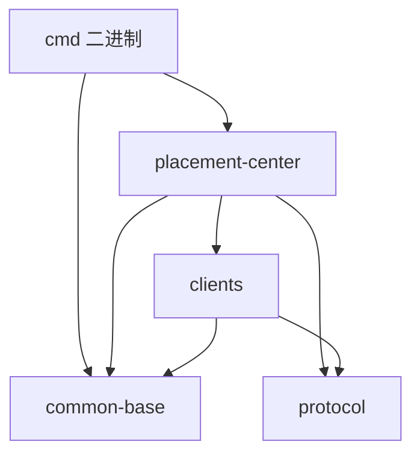

# 01 — Repository Mapping

## 系统目标

robustmq-geek 是 RobustMQ 课程版的 placement-center 反向工程仓库，目标是用
**两条并行的 raft 实现** 演示分布式协调系统的关键设计：节点注册、leader 选举、
日志复制、状态机 apply。业务功能（KV 存储）只是"载体"，真正要展示的是 raft
本身，及其与 RocksDB / gRPC / 配置 / 错误模型 / HTTP 调试面板等周边的拼装方式。

## 工作区目录树（深度 2）

```
robustmq-geek/
├── Cargo.toml                          # workspace + 公共依赖
├── config/
│   ├── placement-center.toml           # 单节点开发配置
│   ├── cluster/                        # 3 节点集群配置
│   └── log4rs.yaml                     # 日志 appender
└── src/
    ├── common/base/                    # 配置 / 错误 / HTTP / 日志 / 工具
    ├── protocol/                       # prost-build 生成的 gRPC stub
    ├── clients/                        # gRPC 客户端 + 连接池
    ├── placement-center/               # 业务库（raft + openraft + storage + server）
    └── cmd/                            # 二进制入口
```

详见 [workspace layout](../atoms/workspace-layout.md)。

## 模块表

| Module | Responsibility | Key files | Depends on | Atom |
|--------|----------------|-----------|------------|------|
| `common-base` | 启动期配置加载（`OnceLock`）；`RobustMQError` 错误枚举；axum HTTP 公共响应；log4rs 初始化 | `config/placement_center.rs`, `errors.rs`, `http_response.rs`, `log/placement_center.rs` | — | [PlacementCenterConfig](../atoms/placement-center-config.md), [RobustMQError](../atoms/robustmq-error.md) |
| `protocol` | prost-build 生成的 4 类 gRPC stub（KV / Placement / OpenRaft / Common） | `src/{kv,placement,openraft,common}.rs` | — | — |
| `clients` | gRPC 客户端封装 + mobc 连接池；`retry_call` 路由层 | `poll.rs`, `placement/{kv,openraft}/{inner.rs,call.rs}` | `common-base`, `protocol` | [ClientPool](../atoms/client-pool.md) |
| `placement-center::storage` | RocksDB 引擎封装；KV / raft / engine / keys 子模块 | `rocksdb.rs`, `engine.rs`, `kv.rs`, `raft.rs`, `keys.rs` | `common-base` | — |
| `placement-center::raft` | 自研 raft 路径（基于 `raft-rs`） | `machine.rs`, `apply.rs`, `route.rs`, `storage.rs`, `metadata.rs`, `peer.rs`, `node.rs` | `protocol`, `clients`, storage | [Dual raft paths](../atoms/dual-raft-paths.md) |
| `placement-center::openraft` | openraft 路径 | `raft_node.rs`, `typeconfig.rs`, `store/{log_store,state_machine_store}.rs`, `network/{network,connection}.rs`, `route/mod.rs` | `protocol`, `clients`, storage | [Dual raft paths](../atoms/dual-raft-paths.md) |
| `placement-center::server` | axum HTTP + tonic gRPC server，挂载 KV/raft/openraft 三类 service | `http/{server,index,openraft}.rs`, `grpc/{server,services_kv,services_kv_new,services_raft,services_openraft}.rs` | 上述全部 | — |
| `cmd` | 二进制入口：clap 解析 → 加载配置 → 调 `start_server` | `placement-center/server.rs` | `common-base`, `placement-center` | — |

## 依赖图



`common-base` 和 `protocol` 是叶子节点，所有路径汇聚到它们。无循环依赖。

## 模块边界（架构基础 vs 偶然工具）

**架构基础（变更代价高）：**
- workspace 内分层 `common-base → protocol → clients → placement-center → cmd`。
- `placement-center` 内部 `storage / raft / openraft / server` 4 个 sub-module 并列。
- 两条 raft 路径（`raft/` 与 `openraft/`）保持平行结构，便于对比。

**偶然工具（替换成本低）：**
- `mobc` 连接池可以换成手写 channel cache。
- `log4rs` 可以换成 `tracing-subscriber`（已经有 `tracing` 依赖了）。
- `clap` 命令行解析极简，可以直接 `std::env::args`。

## 配置 / 构建面

- 配置文件：`config/placement-center.toml`（单机）+ `config/cluster/*.toml`（集群）。
- 日志：`config/log4rs.yaml`，stdout + 文件 rolling，`openraft` 单独走 `raft.log`。
- 构建：`cargo build --release` 即可；prost 生成的 `src/protocol/src/*.rs` 已 commit，
  无需 `build.rs`。`tonic_build::compile` 写在 `tests::build_pb` 里，按需触发。
- CI：`.github/workflows/rust.yml`（rust 构建）+ `pre-commit-config.yaml`。

## 数据流面（高层）

- 客户端 → gRPC `KvService::set` → leader 检测 → `RaftMachineApply::apply_propose_message`
  / `Raft<TypeConfig>::client_write` → raft commit → state machine apply → 成功响应。
- raft 节点之间 → `PlacementCenterService::send_raft_message` / `OpenRaftService::{vote,append,snapshot}`
  → 主循环 step → ready loop → 持久化日志 → ack。

## 未解决问题 / 证据缺口

- 仓库无独立 `architecture.md`、`docs/` 文件夹，只有 README；架构信息只能从代码反推。
- `raft.run()` 在 `lib.rs` 里被注释，运行时只跑 openraft；如果业务发起自研 raft 写入，
  channel 永远没人消费，行为未文档化。
- 集群模式下两条路径如何共存（同一 `RaftGroupMetadata` 写入冲突）没有说明。

后续阶段的 atoms 应当补齐这些缺口。
