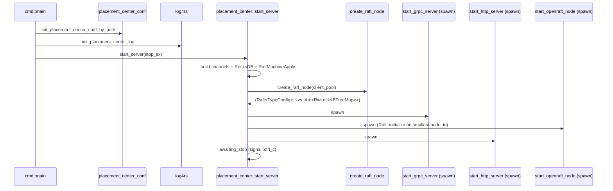

# 02 — Runtime Analysis

## 入口清单

placement-center 进程只有一个二进制入口：

| 入口 | 文件 | 作用 |
|------|------|------|
| `placement-center` 二进制 `main` | `src/cmd/src/placement-center/server.rs:37` | clap 解析 → 加载配置 → 调 `start_server` |
| 库入口 `start_server(stop_sx)` | `src/placement-center/src/lib.rs:44` | 装配运行时；spawn 三个长任务 |
| 集成测试 `kv_test` | `src/placement-center/tests/kv_server.rs:26` | gRPC 端到端 set/get/exists/delete |

详见 [process bootstrap](../atoms/process-bootstrap.md)。

## Startup sequence

详见 [startup flow](startup-flow.md) 和 [openraft cluster init](../atoms/openraft-cluster-init.md)。

## Lifecycle 阶段

| 阶段 | 入场条件 | 出场条件 |
|------|----------|----------|
| **Bootstrap** | 进程启动 | 配置/日志加载完毕 |
| **Wiring** | 进入 `start_server` | 所有共享状态构造完成 |
| **Spawning** | wiring 完成 | 3 个 tokio task 全部 spawn |
| **Initializing** | openraft 节点拉起 | smallest node_id 调 `Raft::initialize` 成功 |
| **Steady state** | initialize 完成 + leader 选出 | 接收读写请求 |
| **Shutting down** | `signal::ctrl_c` 触发 broadcast `true` | 所有 select! 分支 ready，task 退出 |

## 状态机视图

进程内的"长寿命"状态：

| 状态 | 类型 | 拥有者 | 修改路径 |
|------|------|--------|----------|
| `PlacementCenterConfig` | `&'static`（OnceLock） | global | 启动期一次性 init |
| `RocksDBEngine` | `Arc` | 共享 | 通过 `engine_*_by_cluster` 函数读写 |
| `RaftGroupMetadata` | `Arc<RwLock>` | 共享 | `RaftMachine::run` 同步 raft role |
| `RaftMachineApply` | `Arc` | 共享 | 业务/raft 节点间互相投递 RaftMessage |
| `Raft<TypeConfig>` | clone | 共享 | openraft 内部驱动 |
| `kvs: Arc<RwLock<BTreeMap<String, String>>>` | 共享 | openraft state machine + HTTP/gRPC 直读 |

## 代表性请求流

### KV write（openraft 路径，当前唯一启用）

详见 [openraft KV write path](../atoms/openraft-kv-write-path.md) 和 [request flow](request-flow.md)。

简要：
1. `KvServiceClient::set` → tonic
2. `GrpcKvServices::set`（`services_kv_new.rs`）→ 校验 → `raft_node.client_write`
3. openraft propose + replicate（`OpenRaftService::append` peer RPC）
4. 多数派 ack → commit → `StateMachineStore::apply` → `kvs.insert(key, value)`
5. `client_write` future resolve → gRPC 回 `CommonReply`

### KV write（自研 raft 路径，当前主循环未启动）

如果启用 `raft.run()`：
1. `services_kv.rs`：判 `is_leader`；不是则 `placement_set` 转发到 leader。
2. Leader 把 `SetRequest` 编进 `StorageData` → `RaftMachineApply::apply_propose_message`。
3. 主循环 `propose` → 持久化 → `DataRoute::route` apply 到 `KvStorage`（RocksDB）。
4. oneshot ack → 30s 超时映射 `RaftLogCommitTimeout`。

详见 [raft ready loop](../atoms/raft-ready-loop.md)。

### Raft peer message（自研 raft）

1. 对端 `PeersManager` 调本节点的 gRPC `PlacementCenterService::send_raft_message`。
2. `services_raft.rs:GrpcRaftServices::send_raft_message`：prost decode 成
   `raft::eraftpb::Message` → `RaftMachineApply::apply_raft_message`。
3. 主循环 `step(message)`，内部驱动选举/复制状态。

### OpenRaft peer RPC

1. 对端 `Network::send_append_entries` 调 `OpenRaftService::append` gRPC。
2. `services_openraft.rs:GrpcOpenRaftServices::append`：bincode decode openraft 强类型 →
   `Raft::append_entries`。
3. openraft 内部驱动。

## 失败 / 关停行为

- **配置错误**：`panic!`，进程立即挂掉。
- **RocksDB 打开失败**：`panic!`。
- **gRPC bind 失败**：`panic!`。
- **业务命令 30s 不 commit**：`RobustMQError::RaftLogCommitTimeout`，业务返回 `Status::cancelled`。
- **Ctrl+C**：`stop_sx.send(true)`；axum/tonic `select!` 分支收到信号，server task 退出；
  raft / openraft 后台任务通过各自 stop_rx 收到信号停止。
- **panic 隔离**：`tokio::spawn` 每个 task 独立，一个 task panic 不会自动通知其他 task；
  `start_server` 仍然 await `awaiting_stop`，但被 spawn 的子任务死了之后不会重启。

## 未解决问题

- **`raft.run()` 注释**：自研 raft 主循环未启用，但 channel/状态机仍构造，浪费资源。
- **写读不一致**：openraft 写到 `kvs: BTreeMap`（内存），但 `services_kv_new::get` 读
  `KvStorage`（RocksDB），二者不联动——读到的永远是 stale 或空。
- **`cmd::main` 占位 bug**：`(stop_send).await` 不调 `start_server`，照搬运行起不来。
