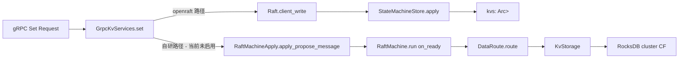

# 03 — Core Design

## Core abstraction map

placement-center 的核心抽象按"层"组织：

```
业务命令     ─→  AppRequestData (openraft) | StorageData (raft-rs)
            │
共识层       ─→  Raft<TypeConfig>            | RawNode + RaftMachine
            │       (openraft 声明式)        | (raft-rs ready loop)
            │
状态机       ─→  StateMachineStore (内存)    | DataRoute → KvStorage (RocksDB)
            │
日志/快照    ─→  LogStore                    | RaftRocksDBStorage
            │
持久层       ─→  RocksDBEngine (共享)
            │
网络层       ─→  Network/Connection (gRPC)   | PeersManager (gRPC)
```

详见 [dual raft paths](../atoms/dual-raft-paths.md)。

## Core object table

| Object | Responsibility | Collaborators | Invariants | Atom |
|--------|---------------|---------------|------------|------|
| `RocksDBEngine` | 单例 RocksDB 封装；提供 CF 句柄 + read/write/delete | 所有持久化模块 | 进程内单实例 | [RocksDBEngine](../atoms/rocksdb-engine.md) |
| `KvStorage` | 业务 KV 操作（自研 raft 路径） | RocksDBEngine | 走 raft commit 后调用 | — |
| `RaftMachineStorage` | raft-rs `Storage` 后端，持久化日志/HardState/Snapshot | RocksDBEngine | 见 [log continuity](../atoms/raft-log-continuity.md) | [raft log continuity](../atoms/raft-log-continuity.md) |
| `RaftRocksDBStorage` | raft-rs `Storage` trait 适配器 | RaftMachineStorage | — | — |
| `RaftMachine` | 自研 raft 主循环 | RawNode + DataRoute + PeersManager | tick 100ms；leader-only propose | [raft ready loop](../atoms/raft-ready-loop.md) |
| `RaftMachineApply` | 业务侧 raft 入口（mpsc + oneshot） | RaftMachine | 30s 超时返回 timeout | — |
| `DataRoute` | 自研路径的状态机分发器 | KvStorage | apply 顺序 = log 顺序 | [DataRoute](../atoms/data-route.md) |
| `PeersManager` | 自研 raft 出站消息发送 | tonic client | 失败仅记日志 | — |
| `RaftGroupMetadata` | 集群成员/角色的内存视图 | RaftMachine | 和 raft-rs role 同步 | — |
| `Raft<TypeConfig>` | openraft 节点 handle | LogStore + StateMachineStore + Network | 见 [TypeConfig](../atoms/openraft-typeconfig.md) | [TypeConfig](../atoms/openraft-typeconfig.md) |
| `LogStore` | openraft `RaftLogStorage` impl | RocksDBEngine | BE u64 key | [BE log key](../atoms/big-endian-log-key.md) |
| `StateMachineStore` | openraft `RaftStateMachine` impl；内存 BTreeMap | — | snapshot = JSON dump | — |
| `Network` / `NetworkConnection` | openraft `RaftNetworkFactory/RaftNetwork` impl | ClientPool | bincode encode + tonic | — |
| `ClientPool` | mobc 连接池（按 service / addr） | tonic client | 上限 = `max_open_connection` | [ClientPool](../atoms/client-pool.md) |
| `HttpServerState` / `GrpcServer` | server 装配点 | 上述全部 | stop_sx broadcast | — |

## Key algorithms

| 算法 | 入口 | Atom |
|------|------|------|
| 进程引导 | `cmd::main` → `start_server` | [process bootstrap](../atoms/process-bootstrap.md) |
| openraft 集群初始化 | `start_openraft_node` | [openraft cluster init](../atoms/openraft-cluster-init.md) |
| 自研 raft ready loop | `RaftMachine::run` → `on_ready` | [raft ready loop](../atoms/raft-ready-loop.md) |
| openraft KV 写入路径 | `KvService::set` → `client_write` → `apply` | [openraft KV write](../atoms/openraft-kv-write-path.md) |

## Invariant catalog

| 不变量 | 保护 | Atom |
|--------|------|------|
| Log continuity (`first <= entries[0]` 且 `last+1 >= entries[0]`) | raft 一致性 | [raft log continuity](../atoms/raft-log-continuity.md) |
| Leader-only write | raft 安全性 | [leader-only write](../atoms/leader-only-write.md) |
| Big-endian log index key | 字典序 == 数值序 | [BE log key](../atoms/big-endian-log-key.md) |
| 配置进程内单例 | 启动期一致 | [PlacementCenterConfig](../atoms/placement-center-config.md) |
| TypeConfig 类型一致 | openraft 编译期保证 | [TypeConfig](../atoms/openraft-typeconfig.md) |

## Extension points / public contracts

| 扩展点 | 形态 | 加新功能时改哪 |
|--------|------|----------------|
| 新 raft 命令 | `StorageDataType` 枚举 + `DataRoute::route` 分支（自研）；`AppRequestData` 枚举 + `StateMachineStore::apply` 分支（openraft） | 需要在两条路径都加，否则只在一条路径上生效 |
| 新 gRPC service | `protocol/src/*.proto` 定义 → 重新生成 stub → 在 `server/grpc/server.rs` 挂载 | 相对独立 |
| 新 HTTP 路由 | `server/http/server.rs` 的 `routes` 函数 | 路由 helper 在 `server/http/mod.rs` |
| 新 storage CF | `RocksDBEngine::new` 创建 CF + 加 `keys.rs` 前缀 | — |
| 新存储后端（替换 RocksDB） | 重写 `RocksDBEngine` + `LogStore` + `RaftMachineStorage` | 业务代码不变 |
| 新连接池策略 | `ClientPool` 内部 + 各 service 的 `Manager` | mobc 自带连接生命周期 |

## 命令处理 / propose 流（合并视图）



## 设计取舍要点

1. **两条路径并存**：详见 [dual raft paths](../atoms/dual-raft-paths.md) 与
   [05-tradeoffs](05-tradeoffs.md)。
2. **state machine 内存 vs 持久化**：openraft state machine 仅在内存（`BTreeMap`），
   靠 snapshot 持久化；自研路径 state machine 直接落 RocksDB（每条 set 都同步写）。
   前者写入快但 crash 后要从 snapshot+log replay；后者每写都同步，但 apply 慢。
3. **RocksDB 共享单例**：所有持久化模块共享一个 DB 实例，CF 隔离。简单，但
   compaction / flush 互相影响。
4. **HTTP 调试面板硬编码**：`server/http/openraft.rs` 把 add_learner / change_membership
   / set 全部硬编码（k1/v1、node_id=3）；只用于课堂演示，生产必须重写。
