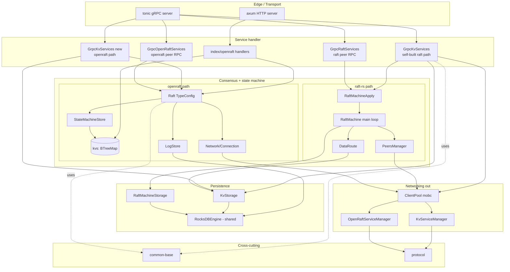
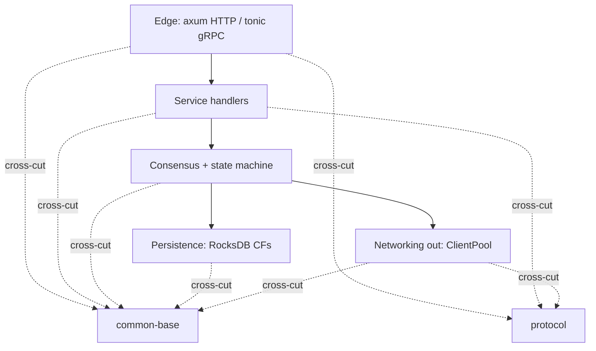
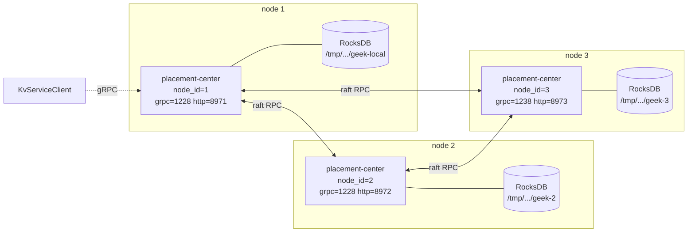

# Architecture Diagram

## 组件视图



## Layer 视图



## 依赖方向

无循环依赖；上层只引用下层：

```
common-base / protocol  (无依赖)
        ↑
        clients
        ↑
        placement-center  (storage / raft / openraft / server)
        ↑
        cmd  (二进制入口)
```

## 部署拓扑（3 节点演示）



每节点：1 个进程、1 个 RocksDB 目录、2 类 gRPC service（业务 KV + raft peer）+
1 个 HTTP 调试面板。

## Sources

- [04 architecture](04-architecture.md)
- [workspace layout](../atoms/workspace-layout.md)
- [dual raft paths](../atoms/dual-raft-paths.md)
- [RocksDBEngine](../atoms/rocksdb-engine.md)
- [client pool](../atoms/client-pool.md)
