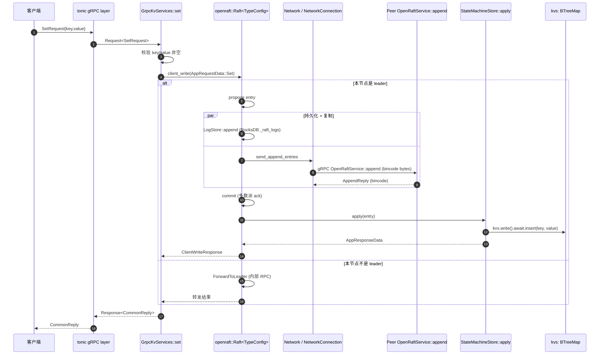

# Request Flow

代表性端到端：`KvServiceClient::set("key", "value")` 一次写入。
当前运行时只跑 openraft 路径，所以 demo 走 `services_kv_new.rs`。

## Mermaid



## 步骤详解

### 1-3 客户端 → tonic → service handler

`KvServiceClient` 通过 tonic channel 发送 protobuf `SetRequest`。
tonic 自动 deserialize 后调到 `GrpcKvServices::set`。

详见 [openraft KV write path](../atoms/openraft-kv-write-path.md)。

### 4 参数校验

`req.key.is_empty() || req.value.is_empty()` → `Status::cancelled`，
错误信息来自 `RobustMQError::ParameterCannotBeNull`。

### 5 进入 openraft

```rust
let data = AppRequestData::Set { key: "k1".to_string(), value: "v1".to_string() };
match self.raft_node.client_write(data).await { ... }
```

**Demo bug**：硬编码 "k1"/"v1"，不是 `req.key/value`。详见 [openraft KV write path](../atoms/openraft-kv-write-path.md) 的 demo bug 段。

### 6-7 复制 + 持久化（leader 上）

openraft 内部：
- propose 转成 `Entry<TypeConfig>`，append 到 `LogStore`（RocksDB `_raft_logs` CF）。
- 同时通过 `Network::new_client(target, node)` 拿到 `NetworkConnection`，
  调 `send_append_entries` → bincode 序列化 → tonic → 对端 `OpenRaftService::append`。
- 对端 `services_openraft.rs:append` 反向反序列化 → `raft_node.append_entries(req).await`。

### 8-10 commit + apply

多数派 ack 后 commit，openraft 调 `StateMachineStore::apply`：
- `EntryPayload::Normal(AppRequestData::Set { key, value })` → `kvs.write().await.insert(key, value)`。
- 更新 `last_applied_log_id`。

### 11 ForwardToLeader 分支

如果调用方是 follower，openraft 自动通过 client API 转发到当前 leader。这层对业务透明。

### 12-13 响应回传

`ClientWriteResponse` resolve → tonic 包装成 `Response<CommonReply::default()>`。

## Read path 对照

```rust
// services_kv_new.rs:get
let kv_storage = KvStorage::new(self.rocksdb_engine_handler.clone());
match kv_storage.get(req.key) { ... }
```

**写读不一致**：写入 openraft state machine 的内存 BTreeMap，但读直接走 RocksDB
`KvStorage`，二者无联动。当前实现只能读到自研 raft 路径写入的数据，
而那条路径主循环又被注释——所以读永远空。

详见 [02-runtime](02-runtime.md#未解决问题) 的 "写读不一致" 段。

## 失败模式

| 失败点 | 表现 | 客户端可见 |
|--------|------|-----------|
| 参数空 | `Status::cancelled("Parameter cannot be empty...")` | gRPC error |
| Leader unreachable | openraft `client_write` Err | `Status::cancelled` |
| Network bincode 解码失败 | `services_openraft.rs:.unwrap()` panic | 整个 server task 挂掉 |
| Apply panic | openraft 内部 propagate | leader 失败，可能触发选举 |
| 30s 内未 commit | openraft `client_write` 超时返回 | `Status::cancelled` |

## Sources

- [openraft KV write path](../atoms/openraft-kv-write-path.md)
- [02-runtime](02-runtime.md)
- [client pool](../atoms/client-pool.md)
