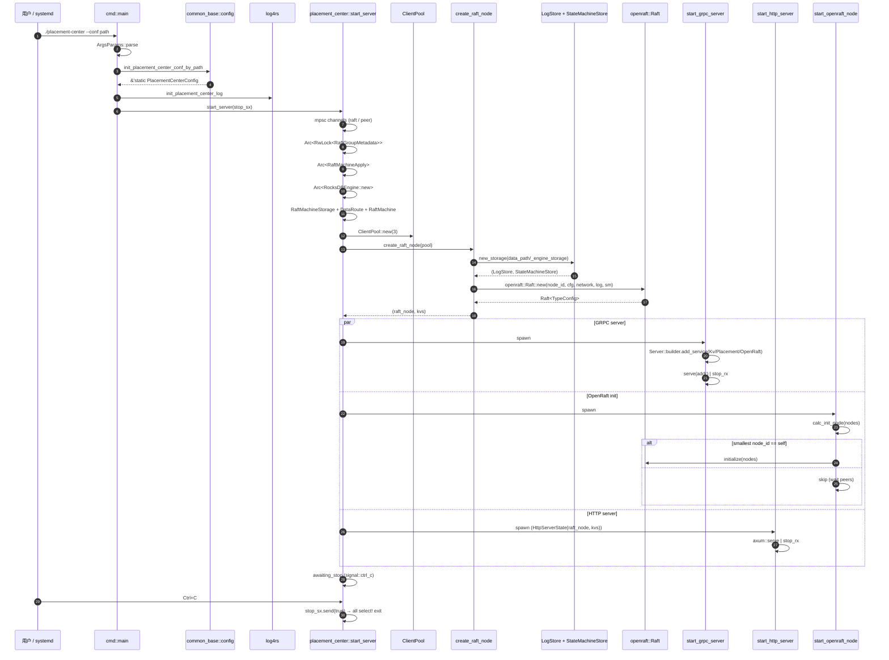

# Startup Flow

完整启动路径走读，从二进制入口到稳态服务可接受请求。

## Sequence

## 关键节点解释

### 1-3 配置加载

`init_placement_center_conf_by_path` 用 `OnceLock::get_or_init` 把 toml 反序列化为
`PlacementCenterConfig`，整个进程内只装载一次。任何 IO/parse 失败 panic，遵循
"启动期 fail-fast" 原则。

### 4 日志初始化

`init_placement_center_log` 根据 `config.log.log_config`（默认
`config/log4rs.yaml`）初始化 log4rs。stdout + 文件 rolling appender 全部就位。

### 5 进入 `start_server`

构造所有"在不同 task 间共享"的状态。所有 Arc 都在这里 clone 出多份，分别给三个
spawn 出去的 task。

### 6 ClientPool

`ClientPool::new(3)` 上限 3 个连接，按 `(service, addr)` 缓存 `mobc::Pool`。
openraft 网络层用它打到 peer 的 gRPC。

### 7 create_raft_node

详见 [openraft cluster init](../atoms/openraft-cluster-init.md) 的 setup 部分：
- log 存储路径：`{data_path}/_engine_storage`，包含 `_raft_logs` + `_raft_store` 两个 CF。
- state machine 是内存 BTreeMap。
- network factory 是 `Network`，每次需要新建 connection 时调 `NetworkConnection::new`。
- `Raft::new` 完成 raft 节点构造，但**还没初始化集群**。

### 8-10 spawn 三个 task

| Task | 作用 | 何时退出 |
|------|------|----------|
| GRPC | tonic 三类 service | `stop_rx` ready 或 serve 错误 |
| OpenRaft init | smallest node_id 调一次 initialize | 一次性，调完就退出 |
| HTTP | axum 路由 | `stop_rx` ready 或 serve 错误 |

### 11 阻塞等停机

`tokio::signal::ctrl_c().await`，捕获 SIGINT 后通过 broadcast 通知所有 select! 分支退出。

## Steady state

完成 startup 后，进程长期处于：
- gRPC 接收 KV 业务请求 + raft peer 消息。
- HTTP 接收健康检查 + openraft 调试调用。
- openraft 后台心跳/选举/复制。

## 与自研 raft 路径的关系

`lib.rs` 中 `// raft.run().await;` 被注释。如果取消注释：
- 还需要再 `tokio::spawn` 一个 task 跑 `RaftMachine::run`。
- 它会消费 `raft_message_recv`、驱动 raft-rs ready loop、apply 到 `KvStorage`。
- 启动后自研 raft 也需要 bootstrap：第一次冷启动需要外部触发（比如 HTTP add-learner / change-membership）。

## Sources

- [process bootstrap](../atoms/process-bootstrap.md)
- [openraft cluster init](../atoms/openraft-cluster-init.md)
- [client pool](../atoms/client-pool.md)
