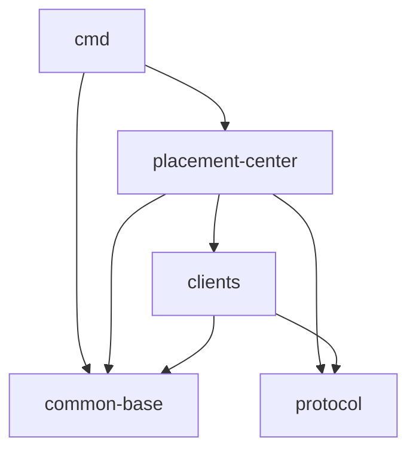

# Workspace Layout

## Definition

robustmq-geek 是单 Cargo workspace，由 5 个 crate 组成。各 crate 单一职责且严格分层，
依赖方向只有一个："上层" 依赖 "下层"，下层不知道上层存在。

## Evidence

- `Cargo.toml`：`[workspace] members = ["src/common/base", "src/placement-center", "src/cmd", "src/protocol", "src/clients"]`。
- 子 crate manifest 列出的 `[dependencies]` 揭示真实依赖边。

## Details

| Crate | 路径 | 职责 | 依赖（workspace 内） |
|-------|------|------|----------|
| `common-base` | `src/common/base` | 配置加载、错误枚举、HTTP 公共响应、log4rs 初始化、工具函数 | 无（最底层） |
| `protocol` | `src/protocol` | prost-build 生成的 4 类 gRPC stub（kv/placement/openraft/common） | 无 |
| `clients` | `src/clients` | gRPC 客户端封装、`mobc` 连接池、按 service 路由 + retry | `common-base`、`protocol` |
| `placement-center` | `src/placement-center` | 业务库：raft、openraft、RocksDB 存储、HTTP/gRPC server | `common-base`、`protocol`、`clients` |
| `cmd` | `src/cmd` | 二进制入口（clap 解析 → 调 `start_server`） | `common-base`、`placement-center` |

## Dependency 形态

依赖方向规整：`common-base` 和 `protocol` 是"叶子"，所有路径最终汇聚到它们。
没有 crate 反向依赖 `placement-center`，没有循环依赖。

## 配置面

- `config/placement-center.toml`：单节点开发配置。
- `config/cluster/placement-center-{1,2,3}.toml`：3 节点集群配置，演示 raft 多副本。
- `config/log4rs.yaml`：日志 appender 配置。
